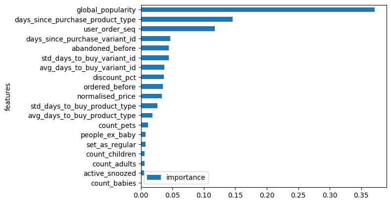
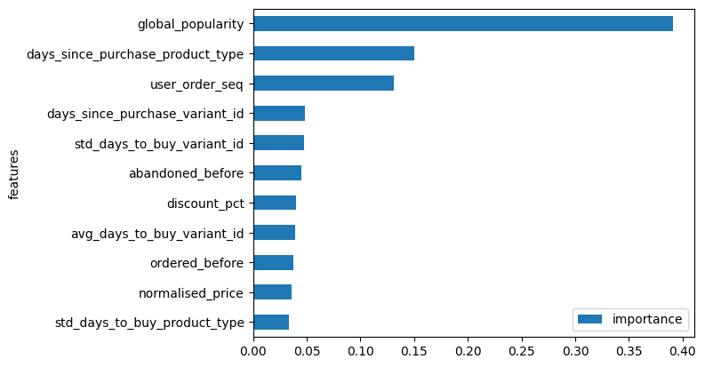
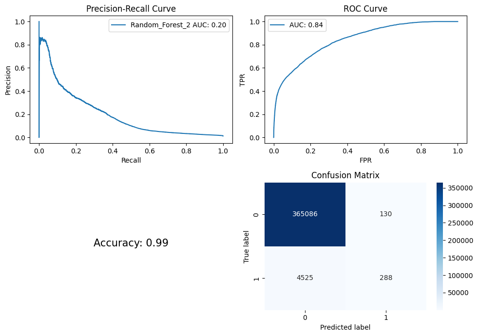
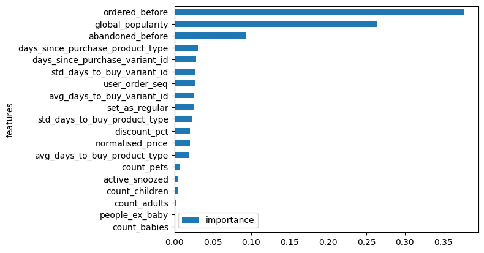
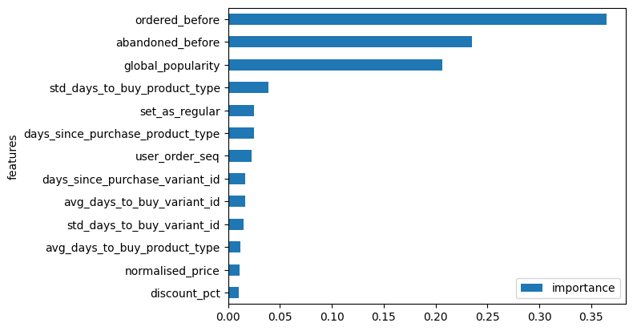

```python
import pandas as pd
import numpy as np
import matplotlib.pyplot as plt
import seaborn as sns
import tensorflow as tf
from sklearn.pipeline import Pipeline
from sklearn.preprocessing import StandardScaler, OneHotEncoder
from sklearn.compose import ColumnTransformer
from sklearn.model_selection import train_test_split
from sklearn.pipeline import make_pipeline
from sklearn.preprocessing import StandardScaler
from sklearn.linear_model import LogisticRegression
from sklearn.metrics import precision_recall_curve, auc, roc_curve, roc_auc_score, accuracy_score, confusion_matrix
from sklearn.ensemble import RandomForestClassifier
from sklearn.metrics import roc_auc_score, average_precision_score, log_loss
from sklearn.ensemble import GradientBoostingClassifier
```

    2024-02-29 01:28:19.133684: I tensorflow/core/platform/cpu_feature_guard.cc:182] This TensorFlow binary is optimized to use available CPU instructions in performance-critical operations.
    To enable the following instructions: AVX2 FMA, in other operations, rebuild TensorFlow with the appropriate compiler flags.


```python
root_folder = "/Users/alvaroleal/Desktop/DS/Zrive"

df_feature_frame = pd.read_csv(root_folder + '/feature_frame.csv')
df_feature_frame.head()
```


<div>
<style scoped>
    .dataframe tbody tr th:only-of-type {
        vertical-align: middle;
    }

    .dataframe tbody tr th {
        vertical-align: top;
    }

    .dataframe thead th {
        text-align: right;
    }
</style>
<table border="1" class="dataframe">
  <thead>
    <tr style="text-align: right;">
      <th></th>
      <th>variant_id</th>
      <th>product_type</th>
      <th>order_id</th>
      <th>user_id</th>
      <th>created_at</th>
      <th>order_date</th>
      <th>user_order_seq</th>
      <th>outcome</th>
      <th>ordered_before</th>
      <th>abandoned_before</th>
      <th>...</th>
      <th>count_children</th>
      <th>count_babies</th>
      <th>count_pets</th>
      <th>people_ex_baby</th>
      <th>days_since_purchase_variant_id</th>
      <th>avg_days_to_buy_variant_id</th>
      <th>std_days_to_buy_variant_id</th>
      <th>days_since_purchase_product_type</th>
      <th>avg_days_to_buy_product_type</th>
      <th>std_days_to_buy_product_type</th>
    </tr>
  </thead>
  <tbody>
    <tr>
      <th>0</th>
      <td>33826472919172</td>
      <td>ricepastapulses</td>
      <td>2807985930372</td>
      <td>3482464092292</td>
      <td>2020-10-05 16:46:19</td>
      <td>2020-10-05 00:00:00</td>
      <td>3</td>
      <td>0.0</td>
      <td>0.0</td>
      <td>0.0</td>
      <td>...</td>
      <td>0.0</td>
      <td>0.0</td>
      <td>0.0</td>
      <td>2.0</td>
      <td>33.0</td>
      <td>42.0</td>
      <td>31.134053</td>
      <td>30.0</td>
      <td>30.0</td>
      <td>24.27618</td>
    </tr>
    <tr>
      <th>1</th>
      <td>33826472919172</td>
      <td>ricepastapulses</td>
      <td>2808027644036</td>
      <td>3466586718340</td>
      <td>2020-10-05 17:59:51</td>
      <td>2020-10-05 00:00:00</td>
      <td>2</td>
      <td>0.0</td>
      <td>0.0</td>
      <td>0.0</td>
      <td>...</td>
      <td>0.0</td>
      <td>0.0</td>
      <td>0.0</td>
      <td>2.0</td>
      <td>33.0</td>
      <td>42.0</td>
      <td>31.134053</td>
      <td>30.0</td>
      <td>30.0</td>
      <td>24.27618</td>
    </tr>
    <tr>
      <th>2</th>
      <td>33826472919172</td>
      <td>ricepastapulses</td>
      <td>2808099078276</td>
      <td>3481384026244</td>
      <td>2020-10-05 20:08:53</td>
      <td>2020-10-05 00:00:00</td>
      <td>4</td>
      <td>0.0</td>
      <td>0.0</td>
      <td>0.0</td>
      <td>...</td>
      <td>0.0</td>
      <td>0.0</td>
      <td>0.0</td>
      <td>2.0</td>
      <td>33.0</td>
      <td>42.0</td>
      <td>31.134053</td>
      <td>30.0</td>
      <td>30.0</td>
      <td>24.27618</td>
    </tr>
    <tr>
      <th>3</th>
      <td>33826472919172</td>
      <td>ricepastapulses</td>
      <td>2808393957508</td>
      <td>3291363377284</td>
      <td>2020-10-06 08:57:59</td>
      <td>2020-10-06 00:00:00</td>
      <td>2</td>
      <td>0.0</td>
      <td>0.0</td>
      <td>0.0</td>
      <td>...</td>
      <td>0.0</td>
      <td>0.0</td>
      <td>0.0</td>
      <td>2.0</td>
      <td>33.0</td>
      <td>42.0</td>
      <td>31.134053</td>
      <td>30.0</td>
      <td>30.0</td>
      <td>24.27618</td>
    </tr>
    <tr>
      <th>4</th>
      <td>33826472919172</td>
      <td>ricepastapulses</td>
      <td>2808429314180</td>
      <td>3537167515780</td>
      <td>2020-10-06 10:37:05</td>
      <td>2020-10-06 00:00:00</td>
      <td>3</td>
      <td>0.0</td>
      <td>0.0</td>
      <td>0.0</td>
      <td>...</td>
      <td>0.0</td>
      <td>0.0</td>
      <td>0.0</td>
      <td>2.0</td>
      <td>33.0</td>
      <td>42.0</td>
      <td>31.134053</td>
      <td>30.0</td>
      <td>30.0</td>
      <td>24.27618</td>
    </tr>
  </tbody>
</table>
<p>5 rows × 27 columns</p>
</div>


```python
min_products = 5
order_size = df_feature_frame.groupby('order_id')['outcome'].sum()
orders_of_min_size = order_size[order_size >= min_products].index
df_filtered = df_feature_frame[df_feature_frame['order_id'].isin(orders_of_min_size)]
```


```python
info_cols = ['variant_id', 'order_id', 'user_id', 'created_at', 'order_date']
label_col = 'outcome'
features_cols = [col for col in df_filtered.columns if col not in info_cols + [label_col]]

categorical_cols = ['product_type', 'vendor']
binary_cols = ['ordered_before', 'abandoned_before', 'active_snoozed', 'set_as_regular']
numerical_cols = [col for col in features_cols if col not in categorical_cols + binary_cols]
```


```python
df_filtered = df_filtered.sort_values('created_at')

order_ids = df_filtered['order_id'].unique()

total_ids = len(order_ids)
train_end = int(total_ids * 0.7)
val_end = train_end + int(total_ids * 0.15)

train_order_ids = order_ids[:train_end]
val_order_ids = order_ids[train_end:val_end]
test_order_ids = order_ids[val_end:]

train_df = df_filtered[df_filtered['order_id'].isin(train_order_ids)]
val_df = df_feature_frame[df_feature_frame['order_id'].isin(val_order_ids)]
test_df = df_feature_frame[df_feature_frame['order_id'].isin(test_order_ids)]

print(f"Train set size: {len(train_df)}")
print(f"Validation set size: {len(val_df)}")
print(f"Test set size: {len(test_df)}")
```

    Train set size: 1446691
    Validation set size: 347233
    Test set size: 370029


```python
def feature_label_split(df, label_col):
    return df.drop(label_col, axis=1), df[label_col]

X_train, y_train = feature_label_split(train_df, label_col)
X_val, y_val = feature_label_split(val_df, label_col)
X_test, y_test = feature_label_split(test_df, label_col)
```


```python
"""""Función para crear los gráficos del performance de nuestro modelo"""
def plot_metrics(model_name, y_pred, y_test, figsize=(10, 7)):
    precision, recall, _ = precision_recall_curve(y_test, y_pred)
    pr_auc = auc(recall, precision)
    fpr, tpr, _ = roc_curve(y_test, y_pred)
    roc_auc = roc_auc_score(y_test, y_pred)
    accuracy = accuracy_score(y_test.astype(np.int64), np.rint(y_pred).astype(np.int64))
    conf_matrix = confusion_matrix(y_test.astype(np.int64), np.rint(y_pred).astype(np.int64))

    fig, ax = plt.subplots(2, 2, figsize=figsize)  # 2x2 para incluir la matriz de confusión

    ax[0, 0].plot(recall, precision, label=f"{model_name} AUC: {pr_auc:.2f}")
    ax[0, 0].set_xlabel("Recall")
    ax[0, 0].set_ylabel("Precision")
    ax[0, 0].set_title(f"Precision-Recall Curve")
    ax[0, 0].legend()

    ax[0, 1].plot(fpr, tpr, label=f"AUC: {roc_auc:.2f}")
    ax[0, 1].set_xlabel("FPR")
    ax[0, 1].set_ylabel("TPR")
    ax[0, 1].set_title(f"ROC Curve")
    ax[0, 1].legend()

    ax[1, 0].axis('off')  # No se necesita eje para mostrar texto
    ax[1, 0].text(0.5, 0.5, f"Accuracy: {accuracy:.2f}", fontsize=15, ha='center')

    sns.heatmap(conf_matrix, annot=True, fmt='d', cmap='Blues', ax=ax[1, 1])
    ax[1, 1].set_title("Confusion Matrix")
    ax[1, 1].set_xlabel("Predicted label")
    ax[1, 1].set_ylabel("True label")

    plt.tight_layout()
    plt.show()
    print("Precision Recall AUC: " + str(pr_auc))
    print("Roc Curve AUC: " + str(roc_auc))
    print("Sum of both AUCs: " + str(pr_auc + roc_auc))
```


```python
"""""Función para ver la importancia de los coeficientes"""
def plot_feature_importance(clf, columns):
    fig, ax = plt.subplots()
    fi = pd.DataFrame(list(zip(columns, clf.feature_importances_)), columns=["features", "importance"])
    fi.sort_values(by="importance", ascending=True, inplace=True)
    fi.plot(kind="barh", x="features", y="importance", ax=ax)
    return fig, ax
```

## Previous Baselines

### Initial Benchmark 

Para nuestra evaluación inicial, utilizamos la característica de "popularidad global" para determinar si el pedido puede ser realizado o no.


```python
plot_metrics("Baseline with global popularity",val_df["global_popularity"],val_df[label_col])
```


    

    


### Best Linear models result

Para nuestra segunda evaluación, emplearemos el modelo lineal que mostró mejores resultados en el ejercicio anterior: regresión Lasso sin variables categóricas, eliminando variables con una importancia menor a 0.02.


```python
train_cols = ["days_since_purchase_variant_id", "discount_pct", "std_days_to_buy_product_type", "count_pets", "set_as_regular", "avg_days_to_buy_product_type", "days_since_purchase_product_type", "user_order_seq", "avg_days_to_buy_variant_id", "abandoned_before", "global_popularity", "normalised_price", "ordered_before",]

regularization_values = [1e-4, 1e-3, 1e-2, 1e-1, 1, 10]

best_auc = 0
best_c = None
best_model = None

for c in regularization_values:
    lr = make_pipeline(
        StandardScaler(),
        LogisticRegression(penalty='l1',C=c, solver='liblinear')
    )
    lr.fit(X_train[train_cols], y_train)

    y_proba = lr.predict_proba(X_test[train_cols])[:, 1]
    
    roc_auc = roc_auc_score(y_test, y_proba)
    
    if roc_auc > best_auc:
        best_auc = roc_auc
        best_c = c
        best_model = lr

y_pred = best_model.predict_proba(X_test[train_cols])[:, 1]

plot_metrics(f"LR: C={best_c}", y_pred, y_test)

y_pred = best_model.predict_proba(X_val[train_cols])[:, 1]

plot_metrics(f"LR: C={best_c}", y_pred, y_val)
```


    

    


    Precision Recall AUC: 0.14909622626798194
    Roc Curve AUC: 0.8321347472511265


    

    


    Precision Recall AUC: 0.14868719039041456
    Roc Curve AUC: 0.8348974327812615


## Non Linear Models

El propósito de este ejercicio es superar los resultados que logramos con nuestro mejor modelo lineal de la semana pasada, utilizando modelos no lineales. Con estos modelos no lineales, pretendemos aumentar la complejidad de nuestro modelo con el objetivo de mejorar su rendimiento.

Para empezar, desarrollaremos dos modelos:  Random Forest y Gradient Boosting Trees

## Random Forest

Comenzaremos iterando los diferentes parámetros de nuestro modelo para determinar los valores óptimos para nuestro conjunto de datos.


```python
train_cols = numerical_cols + binary_cols

n_trees_grid = [5, 25, 50, 100]

metrics = {
    'n_trees': [],
    'train_auc': [],
    'val_auc': [],
    'train_ap': [],
    'val_ap': [],
    'train_ce': [],
    'val_ce': []
}

for n_trees in n_trees_grid:
    rf = RandomForestClassifier(n_estimators=n_trees)
    rf.fit(X_train[train_cols], y_train)
    
    train_probs = rf.predict_proba(X_train[train_cols])[:, 1]
    val_probs = rf.predict_proba(X_val[train_cols])[:, 1]
    
    metrics['n_trees'].append(n_trees)
    metrics['train_auc'].append(roc_auc_score(y_train, train_probs))
    metrics['val_auc'].append(roc_auc_score(y_val, val_probs))
    metrics['train_ap'].append(average_precision_score(y_train, train_probs))
    metrics['val_ap'].append(average_precision_score(y_val, val_probs))
    metrics['train_ce'].append(log_loss(y_train, train_probs))
    metrics['val_ce'].append(log_loss(y_val, val_probs))

print("Métricas:")
for i in range(len(n_trees_grid)):
    print(f"# Trees: {metrics['n_trees'][i]}")
    print(f"Train AUC: {metrics['train_auc'][i]:.4f}, Validation AUC: {metrics['val_auc'][i]:.4f}")
    print(f"Train AP: {metrics['train_ap'][i]:.4f}, Validation AP: {metrics['val_ap'][i]:.4f}")
    print(f"Train Cross Entropy: {metrics['train_ce'][i]:.4f}, Validation Cross Entropy: {metrics['val_ce'][i]:.4f}")
    print()
```

    Métricas:
    # Trees: 5
    Train AUC: 0.9909, Validation AUC: 0.6442
    Train AP: 0.7707, Validation AP: 0.0707
    Train Cross Entropy: 0.0243, Validation Cross Entropy: 0.3497
    
    # Trees: 25
    Train AUC: 0.9952, Validation AUC: 0.7161
    Train AP: 0.8524, Validation AP: 0.1128
    Train Cross Entropy: 0.0209, Validation Cross Entropy: 0.2489
    
    # Trees: 50
    Train AUC: 0.9955, Validation AUC: 0.7302
    Train AP: 0.8598, Validation AP: 0.1185
    Train Cross Entropy: 0.0207, Validation Cross Entropy: 0.2231
    
    # Trees: 100
    Train AUC: 0.9957, Validation AUC: 0.7484
    Train AP: 0.8628, Validation AP: 0.1248
    Train Cross Entropy: 0.0206, Validation Cross Entropy: 0.1915
    


Tras ejecutar este código, podemos observar los siguientes aspectos:

- La elevada precisión obtenida en el conjunto de entrenamiento es un resultado esperado, considerando que estamos implementando un modelo de bosque aleatorio.
- Se constata una mejora considerable en el rendimiento del modelo con el aumento en el número de árboles. Aunque sería factible continuar ajustando este parámetro, experimentando con valores como 150 o 200, las restricciones de tiempo nos llevan a establecer 100 como el número óptimo de árboles.

### Model 1. Random Forest - Without categorical variables

Iniciaremos el entrenamiento de un primer modelo utilizando los parámetros previamente seleccionados y enfocándonos únicamente en las variables numéricas. Por el momento, excluiremos las variables categóricas debido a su complejidad.


```python
train_cols = numerical_cols + binary_cols

n_trees = 100

rf = RandomForestClassifier(n_estimators=n_trees)
rf.fit(X_train[train_cols], y_train)

train_probs = rf.predict_proba(X_train[train_cols])[:, 1]
test_probs = rf.predict_proba(X_test[train_cols])[:, 1]
val_probs = rf.predict_proba(X_val[train_cols])[:, 1]

print(f"Train_auc: {roc_auc_score(y_train, train_probs)}")
print(f"Val_auc {roc_auc_score(y_val, val_probs)}")
print(f"Train_ap {average_precision_score(y_train, train_probs)}")
print(f"Val_ap {average_precision_score(y_val, val_probs)}")
print(f"Train_ce {log_loss(y_train, train_probs)}")
print(f"Val_ce {log_loss(y_val, val_probs)}")

plot_metrics("Random_Forest_2", test_probs, y_test)
plot_metrics("Random_Forest_2", val_probs, y_val)
```


<style>#sk-container-id-1 {
  /* Definition of color scheme common for light and dark mode */
  --sklearn-color-text: black;
  --sklearn-color-line: gray;
  /* Definition of color scheme for unfitted estimators */
  --sklearn-color-unfitted-level-0: #fff5e6;
  --sklearn-color-unfitted-level-1: #f6e4d2;
  --sklearn-color-unfitted-level-2: #ffe0b3;
  --sklearn-color-unfitted-level-3: chocolate;
  /* Definition of color scheme for fitted estimators */
  --sklearn-color-fitted-level-0: #f0f8ff;
  --sklearn-color-fitted-level-1: #d4ebff;
  --sklearn-color-fitted-level-2: #b3dbfd;
  --sklearn-color-fitted-level-3: cornflowerblue;

  /* Specific color for light theme */
  --sklearn-color-text-on-default-background: var(--sg-text-color, var(--theme-code-foreground, var(--jp-content-font-color1, black)));
  --sklearn-color-background: var(--sg-background-color, var(--theme-background, var(--jp-layout-color0, white)));
  --sklearn-color-border-box: var(--sg-text-color, var(--theme-code-foreground, var(--jp-content-font-color1, black)));
  --sklearn-color-icon: #696969;

  @media (prefers-color-scheme: dark) {
    /* Redefinition of color scheme for dark theme */
    --sklearn-color-text-on-default-background: var(--sg-text-color, var(--theme-code-foreground, var(--jp-content-font-color1, white)));
    --sklearn-color-background: var(--sg-background-color, var(--theme-background, var(--jp-layout-color0, #111)));
    --sklearn-color-border-box: var(--sg-text-color, var(--theme-code-foreground, var(--jp-content-font-color1, white)));
    --sklearn-color-icon: #878787;
  }
}

#sk-container-id-1 {
  color: var(--sklearn-color-text);
}

#sk-container-id-1 pre {
  padding: 0;
}

#sk-container-id-1 input.sk-hidden--visually {
  border: 0;
  clip: rect(1px 1px 1px 1px);
  clip: rect(1px, 1px, 1px, 1px);
  height: 1px;
  margin: -1px;
  overflow: hidden;
  padding: 0;
  position: absolute;
  width: 1px;
}

#sk-container-id-1 div.sk-dashed-wrapped {
  border: 1px dashed var(--sklearn-color-line);
  margin: 0 0.4em 0.5em 0.4em;
  box-sizing: border-box;
  padding-bottom: 0.4em;
  background-color: var(--sklearn-color-background);
}

#sk-container-id-1 div.sk-container {
  /* jupyter's `normalize.less` sets `[hidden] { display: none; }`
     but bootstrap.min.css set `[hidden] { display: none !important; }`
     so we also need the `!important` here to be able to override the
     default hidden behavior on the sphinx rendered scikit-learn.org.
     See: https://github.com/scikit-learn/scikit-learn/issues/21755 */
  display: inline-block !important;
  position: relative;
}

#sk-container-id-1 div.sk-text-repr-fallback {
  display: none;
}

div.sk-parallel-item,
div.sk-serial,
div.sk-item {
  /* draw centered vertical line to link estimators */
  background-image: linear-gradient(var(--sklearn-color-text-on-default-background), var(--sklearn-color-text-on-default-background));
  background-size: 2px 100%;
  background-repeat: no-repeat;
  background-position: center center;
}

/* Parallel-specific style estimator block */

#sk-container-id-1 div.sk-parallel-item::after {
  content: "";
  width: 100%;
  border-bottom: 2px solid var(--sklearn-color-text-on-default-background);
  flex-grow: 1;
}

#sk-container-id-1 div.sk-parallel {
  display: flex;
  align-items: stretch;
  justify-content: center;
  background-color: var(--sklearn-color-background);
  position: relative;
}

#sk-container-id-1 div.sk-parallel-item {
  display: flex;
  flex-direction: column;
}

#sk-container-id-1 div.sk-parallel-item:first-child::after {
  align-self: flex-end;
  width: 50%;
}

#sk-container-id-1 div.sk-parallel-item:last-child::after {
  align-self: flex-start;
  width: 50%;
}

#sk-container-id-1 div.sk-parallel-item:only-child::after {
  width: 0;
}

/* Serial-specific style estimator block */

#sk-container-id-1 div.sk-serial {
  display: flex;
  flex-direction: column;
  align-items: center;
  background-color: var(--sklearn-color-background);
  padding-right: 1em;
  padding-left: 1em;
}


/* Toggleable style: style used for estimator/Pipeline/ColumnTransformer box that is
clickable and can be expanded/collapsed.
- Pipeline and ColumnTransformer use this feature and define the default style
- Estimators will overwrite some part of the style using the `sk-estimator` class
*/

/* Pipeline and ColumnTransformer style (default) */

#sk-container-id-1 div.sk-toggleable {
  /* Default theme specific background. It is overwritten whether we have a
  specific estimator or a Pipeline/ColumnTransformer */
  background-color: var(--sklearn-color-background);
}

/* Toggleable label */
#sk-container-id-1 label.sk-toggleable__label {
  cursor: pointer;
  display: block;
  width: 100%;
  margin-bottom: 0;
  padding: 0.5em;
  box-sizing: border-box;
  text-align: center;
}

#sk-container-id-1 label.sk-toggleable__label-arrow:before {
  /* Arrow on the left of the label */
  content: "▸";
  float: left;
  margin-right: 0.25em;
  color: var(--sklearn-color-icon);
}

#sk-container-id-1 label.sk-toggleable__label-arrow:hover:before {
  color: var(--sklearn-color-text);
}

/* Toggleable content - dropdown */

#sk-container-id-1 div.sk-toggleable__content {
  max-height: 0;
  max-width: 0;
  overflow: hidden;
  text-align: left;
  /* unfitted */
  background-color: var(--sklearn-color-unfitted-level-0);
}

#sk-container-id-1 div.sk-toggleable__content.fitted {
  /* fitted */
  background-color: var(--sklearn-color-fitted-level-0);
}

#sk-container-id-1 div.sk-toggleable__content pre {
  margin: 0.2em;
  border-radius: 0.25em;
  color: var(--sklearn-color-text);
  /* unfitted */
  background-color: var(--sklearn-color-unfitted-level-0);
}

#sk-container-id-1 div.sk-toggleable__content.fitted pre {
  /* unfitted */
  background-color: var(--sklearn-color-fitted-level-0);
}

#sk-container-id-1 input.sk-toggleable__control:checked~div.sk-toggleable__content {
  /* Expand drop-down */
  max-height: 200px;
  max-width: 100%;
  overflow: auto;
}

#sk-container-id-1 input.sk-toggleable__control:checked~label.sk-toggleable__label-arrow:before {
  content: "▾";
}

/* Pipeline/ColumnTransformer-specific style */

#sk-container-id-1 div.sk-label input.sk-toggleable__control:checked~label.sk-toggleable__label {
  color: var(--sklearn-color-text);
  background-color: var(--sklearn-color-unfitted-level-2);
}

#sk-container-id-1 div.sk-label.fitted input.sk-toggleable__control:checked~label.sk-toggleable__label {
  background-color: var(--sklearn-color-fitted-level-2);
}

/* Estimator-specific style */

/* Colorize estimator box */
#sk-container-id-1 div.sk-estimator input.sk-toggleable__control:checked~label.sk-toggleable__label {
  /* unfitted */
  background-color: var(--sklearn-color-unfitted-level-2);
}

#sk-container-id-1 div.sk-estimator.fitted input.sk-toggleable__control:checked~label.sk-toggleable__label {
  /* fitted */
  background-color: var(--sklearn-color-fitted-level-2);
}

#sk-container-id-1 div.sk-label label.sk-toggleable__label,
#sk-container-id-1 div.sk-label label {
  /* The background is the default theme color */
  color: var(--sklearn-color-text-on-default-background);
}

/* On hover, darken the color of the background */
#sk-container-id-1 div.sk-label:hover label.sk-toggleable__label {
  color: var(--sklearn-color-text);
  background-color: var(--sklearn-color-unfitted-level-2);
}

/* Label box, darken color on hover, fitted */
#sk-container-id-1 div.sk-label.fitted:hover label.sk-toggleable__label.fitted {
  color: var(--sklearn-color-text);
  background-color: var(--sklearn-color-fitted-level-2);
}

/* Estimator label */

#sk-container-id-1 div.sk-label label {
  font-family: monospace;
  font-weight: bold;
  display: inline-block;
  line-height: 1.2em;
}

#sk-container-id-1 div.sk-label-container {
  text-align: center;
}

/* Estimator-specific */
#sk-container-id-1 div.sk-estimator {
  font-family: monospace;
  border: 1px dotted var(--sklearn-color-border-box);
  border-radius: 0.25em;
  box-sizing: border-box;
  margin-bottom: 0.5em;
  /* unfitted */
  background-color: var(--sklearn-color-unfitted-level-0);
}

#sk-container-id-1 div.sk-estimator.fitted {
  /* fitted */
  background-color: var(--sklearn-color-fitted-level-0);
}

/* on hover */
#sk-container-id-1 div.sk-estimator:hover {
  /* unfitted */
  background-color: var(--sklearn-color-unfitted-level-2);
}

#sk-container-id-1 div.sk-estimator.fitted:hover {
  /* fitted */
  background-color: var(--sklearn-color-fitted-level-2);
}

/* Specification for estimator info (e.g. "i" and "?") */

/* Common style for "i" and "?" */

.sk-estimator-doc-link,
a:link.sk-estimator-doc-link,
a:visited.sk-estimator-doc-link {
  float: right;
  font-size: smaller;
  line-height: 1em;
  font-family: monospace;
  background-color: var(--sklearn-color-background);
  border-radius: 1em;
  height: 1em;
  width: 1em;
  text-decoration: none !important;
  margin-left: 1ex;
  /* unfitted */
  border: var(--sklearn-color-unfitted-level-1) 1pt solid;
  color: var(--sklearn-color-unfitted-level-1);
}

.sk-estimator-doc-link.fitted,
a:link.sk-estimator-doc-link.fitted,
a:visited.sk-estimator-doc-link.fitted {
  /* fitted */
  border: var(--sklearn-color-fitted-level-1) 1pt solid;
  color: var(--sklearn-color-fitted-level-1);
}

/* On hover */
div.sk-estimator:hover .sk-estimator-doc-link:hover,
.sk-estimator-doc-link:hover,
div.sk-label-container:hover .sk-estimator-doc-link:hover,
.sk-estimator-doc-link:hover {
  /* unfitted */
  background-color: var(--sklearn-color-unfitted-level-3);
  color: var(--sklearn-color-background);
  text-decoration: none;
}

div.sk-estimator.fitted:hover .sk-estimator-doc-link.fitted:hover,
.sk-estimator-doc-link.fitted:hover,
div.sk-label-container:hover .sk-estimator-doc-link.fitted:hover,
.sk-estimator-doc-link.fitted:hover {
  /* fitted */
  background-color: var(--sklearn-color-fitted-level-3);
  color: var(--sklearn-color-background);
  text-decoration: none;
}

/* Span, style for the box shown on hovering the info icon */
.sk-estimator-doc-link span {
  display: none;
  z-index: 9999;
  position: relative;
  font-weight: normal;
  right: .2ex;
  padding: .5ex;
  margin: .5ex;
  width: min-content;
  min-width: 20ex;
  max-width: 50ex;
  color: var(--sklearn-color-text);
  box-shadow: 2pt 2pt 4pt #999;
  /* unfitted */
  background: var(--sklearn-color-unfitted-level-0);
  border: .5pt solid var(--sklearn-color-unfitted-level-3);
}

.sk-estimator-doc-link.fitted span {
  /* fitted */
  background: var(--sklearn-color-fitted-level-0);
  border: var(--sklearn-color-fitted-level-3);
}

.sk-estimator-doc-link:hover span {
  display: block;
}

/* "?"-specific style due to the `<a>` HTML tag */

#sk-container-id-1 a.estimator_doc_link {
  float: right;
  font-size: 1rem;
  line-height: 1em;
  font-family: monospace;
  background-color: var(--sklearn-color-background);
  border-radius: 1rem;
  height: 1rem;
  width: 1rem;
  text-decoration: none;
  /* unfitted */
  color: var(--sklearn-color-unfitted-level-1);
  border: var(--sklearn-color-unfitted-level-1) 1pt solid;
}

#sk-container-id-1 a.estimator_doc_link.fitted {
  /* fitted */
  border: var(--sklearn-color-fitted-level-1) 1pt solid;
  color: var(--sklearn-color-fitted-level-1);
}

/* On hover */
#sk-container-id-1 a.estimator_doc_link:hover {
  /* unfitted */
  background-color: var(--sklearn-color-unfitted-level-3);
  color: var(--sklearn-color-background);
  text-decoration: none;
}

#sk-container-id-1 a.estimator_doc_link.fitted:hover {
  /* fitted */
  background-color: var(--sklearn-color-fitted-level-3);
}
</style><div id="sk-container-id-1" class="sk-top-container"><div class="sk-text-repr-fallback"><pre>RandomForestClassifier()</pre><b>In a Jupyter environment, please rerun this cell to show the HTML representation or trust the notebook. <br />On GitHub, the HTML representation is unable to render, please try loading this page with nbviewer.org.</b></div><div class="sk-container" hidden><div class="sk-item"><div class="sk-estimator fitted sk-toggleable"><input class="sk-toggleable__control sk-hidden--visually" id="sk-estimator-id-1" type="checkbox" checked><label for="sk-estimator-id-1" class="sk-toggleable__label fitted sk-toggleable__label-arrow fitted">&nbsp;&nbsp;RandomForestClassifier<a class="sk-estimator-doc-link fitted" rel="noreferrer" target="_blank" href="https://scikit-learn.org/1.4/modules/generated/sklearn.ensemble.RandomForestClassifier.html">?<span>Documentation for RandomForestClassifier</span></a><span class="sk-estimator-doc-link fitted">i<span>Fitted</span></span></label><div class="sk-toggleable__content fitted"><pre>RandomForestClassifier()</pre></div> </div></div></div></div>


```python
plot_feature_importance(rf, train_cols)
```


    (<Figure size 640x480 with 1 Axes>, <Axes: ylabel='features'>)


    

    


### Model 2: Random Forest - Without categorical variables - variables with importance > 0.02

La distribución de la importancia de los coeficientes en nuestro modelo no parece equilibrada. Por tanto, procederemos a desarrollar un nuevo modelo simplificado, descartando aquellos coeficientes que presenten una importancia inferior a 0.02.


```python
train_cols = ["global_popularity", "days_since_purchase_product_type", "user_order_seq", "days_since_purchase_variant_id", "abandoned_before", "std_days_to_buy_variant_id", "avg_days_to_buy_variant_id", "discount_pct", "normalised_price", "ordered_before", "std_days_to_buy_product_type"]

n_trees = 100

rf_2 = RandomForestClassifier(n_estimators=n_trees)
rf_2.fit(X_train[train_cols], y_train)
    
train_probs = rf_2.predict_proba(X_train[train_cols])[:, 1]
test_probs = rf_2.predict_proba(X_test[train_cols])[:, 1]
val_probs = rf_2.predict_proba(X_val[train_cols])[:, 1]

print(f"Train_auc: {roc_auc_score(y_train, train_probs)}.",f"Val_auc {roc_auc_score(y_val, val_probs)}")
print(f"Train_ap {average_precision_score(y_train, train_probs)}.",f"Val_ap {average_precision_score(y_val, val_probs)}")
print(f"Train_ce {log_loss(y_train, train_probs)}.",f"Val_ce {log_loss(y_val, val_probs)}")

plot_metrics("Random_Forest_2", test_probs, y_test)
plot_metrics("Random_Forest_2", val_probs, y_val)
```

    Train_auc: 0.9951735546753651
    Val_auc 0.7437482863079924
    Train_ap 0.8479491372821064
    Val_ap 0.110158456175734
    Train_ce 0.021404713671575235
    Val_ce 0.18508661408635912


    

    


    Precision Recall AUC: 0.11948090674617384
    Roc Curve AUC: 0.7434437365377136


    

    


    Precision Recall AUC: 0.11331897652079789
    Roc Curve AUC: 0.7437482863079924


```python
plot_feature_importance(rf_2, train_cols)
```


    (<Figure size 640x480 with 1 Axes>, <Axes: ylabel='features'>)


    

    


Parece que, en este modelo específico, la eliminación de los coeficientes con menor importancia no ha tenido un impacto significativo.

## Gradient Boosting Trees

Para continuar avanzando con la práctica, experimentaremos con modelos de Gradient Boosting Trees, utilizando los modelos anteriores como punto de referencia. Comenzaremos ajustando los distintos parámetros de nuestro modelo para identificar la configuración más óptima. Para simplificar el proceso, fijaremos el número de árboles en 100 como valor predeterminado para el modelo, ya que realizar iteraciones como en ocasiones anteriores consume demasiado tiempo.


```python
train_cols = numerical_cols + binary_cols

learning_rates = [0.05, 0.1]
max_depths = [1, 3, 5]
n_trees_grid = [100] 

for lr in learning_rates:
    for depth in max_depths:
        for n_trees in n_trees_grid:
        
            gbt = GradientBoostingClassifier(learning_rate=lr, max_depth=depth, n_estimators=n_trees)
            gbt.fit(X_train[train_cols], y_train)

            train_probs = gbt.predict_proba(X_train[train_cols])[:, 1]
            val_probs = gbt.predict_proba(X_val[train_cols])[:, 1]
            
            print(f"LR: {lr} , max depth: {depth} , trees: {n_trees}")
            print(f"Train_auc: {roc_auc_score(y_train, train_probs)}.",f"Val_auc {roc_auc_score(y_val, val_probs)}")
            print(f"Train_ap {average_precision_score(y_train, train_probs)}.",f"Val_ap {average_precision_score(y_val, val_probs)}")
            print(f"Train_ce {log_loss(y_train, train_probs)}.",f"Val_ce {log_loss(y_val, val_probs)}")
            print()
```

    LR: 0.05 , max depth: 1 , trees: 100
    Train_auc: 0.8301458956930725. Val_auc 0.8312186637150558
    Train_ap 0.16767192049564272. Val_ap 0.16223106879171462
    Train_ce 0.06426211044693811. Val_ce 0.059000992051593364
    
    LR: 0.05 , max depth: 3 , trees: 100
    Train_auc: 0.8396903084216806. Val_auc 0.8435452272727766
    Train_ap 0.19778186825699245. Val_ap 0.19022340151152622
    Train_ce 0.06199000435585811. Val_ce 0.05672782580877858
    
    LR: 0.05 , max depth: 5 , trees: 100
    Train_auc: 0.8435100171277288. Val_auc 0.8463572394225133
    Train_ap 0.21953226676443446. Val_ap 0.1920676485067287
    Train_ce 0.06103491979394085. Val_ce 0.056399081302549184
    
    LR: 0.1 , max depth: 1 , trees: 100
    Train_auc: 0.8358799708210739. Val_auc 0.8393641217200688
    Train_ap 0.17593635436885469. Val_ap 0.16857991236789077
    Train_ce 0.06316355392672933. Val_ce 0.057949011320279666
    
    LR: 0.1 , max depth: 3 , trees: 100
    Train_auc: 0.8429258459731755. Val_auc 0.8461584590391725
    Train_ap 0.20318960813263492. Val_ap 0.18849142908995345
    Train_ce 0.06144115790586009. Val_ce 0.05656714665860696
    
    LR: 0.1 , max depth: 5 , trees: 100
    Train_auc: 0.8467844885989544. Val_auc 0.8468950941991035
    Train_ap 0.23195864588926668. Val_ap 0.18541216419524398
    Train_ce 0.06029831069775434. Val_ce 0.056770955948077816
    


Tras esta iteración, hemos determinado los parámetros más óptimos en términos de tasa de aprendizaje (learning rate) y profundidad (depth) para nuestros modelos. Ahora procederemos a entrenar nuestros modelos de Gradient Boosting Trees utilizando estos parámetros seleccionados.

### Model 3: Gradient Boosting Three - Without categorical variables

Siguiendo la misma estrategia empleada con los modelos anteriores, iniciaremos el entrenamiento de un modelo excluyendo las variables categóricas.


```python
train_cols = numerical_cols + binary_cols

lr = 0.05
depth = 5
n_trees = 100

gbt = GradientBoostingClassifier(learning_rate=lr, max_depth=depth, n_estimators=n_trees)
gbt.fit(X_train[train_cols], y_train)

train_probs = gbt.predict_proba(X_train[train_cols])[:, 1]
test_probs = gbt.predict_proba(X_test[train_cols])[:, 1]
val_probs = gbt.predict_proba(X_val[train_cols])[:, 1]

print(f"Train_auc: {roc_auc_score(y_train, train_probs)}.",f"Val_auc {roc_auc_score(y_val, val_probs)}")
print(f"Train_ap {average_precision_score(y_train, train_probs)}.",f"Val_ap {average_precision_score(y_val, val_probs)}")
print(f"Train_ce {log_loss(y_train, train_probs)}.",f"Val_ce {log_loss(y_val, val_probs)}")

plot_metrics("Random_Forest_2", test_probs, y_test)
plot_metrics("Random_Forest_2", val_probs, y_val)
```

    Train_auc: 0.8435100171277288. Val_auc 0.8463536274974822
    Train_ap 0.21953226676443446. Val_ap 0.1919927932412116
    Train_ce 0.06103491979394085. Val_ce 0.05640256031956773


    

    


    Precision Recall AUC: 0.19890975902943264
    Roc Curve AUC: 0.844747437906795
    Sum of both AUCs: 1.0436571969362276


    

    


    Precision Recall AUC: 0.19178290046990729
    Roc Curve AUC: 0.8463536274974822
    Sum of both AUCs: 1.0381365279673895


```python
plot_feature_importance(gbt, train_cols)
```


    (<Figure size 640x480 with 1 Axes>, <Axes: ylabel='features'>)


    

    


### Model 4: Gradient Boosting Three - Without categorical variables - variables with importance > 0.02

Intentaremos mejorar nuestro modelo una vez más al reducir su complejidad, eliminando aquellos coeficientes que resulten menos significativos.


```python
train_cols = ["global_popularity", "days_since_purchase_product_type", "user_order_seq", "days_since_purchase_variant_id", "abandoned_before", "std_days_to_buy_variant_id", "avg_days_to_buy_variant_id", "set_as_regular", "discount_pct", "normalised_price", "ordered_before", "std_days_to_buy_product_type", "avg_days_to_buy_product_type"]

lr = 0.05
depth = 5
n_trees = 100

gbt = GradientBoostingClassifier(learning_rate=lr, max_depth=depth, n_estimators=n_trees)
gbt.fit(X_train[train_cols], y_train)

train_probs = gbt.predict_proba(X_train[train_cols])[:, 1]
test_probs = gbt.predict_proba(X_test[train_cols])[:, 1]
val_probs = gbt.predict_proba(X_val[train_cols])[:, 1]

print(f"Train_auc: {roc_auc_score(y_train, train_probs)}.",f"Val_auc {roc_auc_score(y_val, val_probs)}")
print(f"Train_ap {average_precision_score(y_train, train_probs)}.",f"Val_ap {average_precision_score(y_val, val_probs)}")
print(f"Train_ce {log_loss(y_train, train_probs)}.",f"Val_ce {log_loss(y_val, val_probs)}")

plot_metrics("Random_Forest_2", test_probs, y_test)
plot_metrics("Random_Forest_2", val_probs, y_val)
```

    Train_auc: 0.843473214235045. Val_auc 0.846327982213392
    Train_ap 0.21841262473539977. Val_ap 0.19257618354668404
    Train_ce 0.06105798499900578. Val_ce 0.0563746229992203


    

    


    Precision Recall AUC: 0.1992181888589764
    Roc Curve AUC: 0.8448881570818715
    Sum of both AUCs: 1.044106345940848


    

    


    Precision Recall AUC: 0.19235713920249017
    Roc Curve AUC: 0.846327982213392
    Sum of both AUCs: 1.038685121415882


```python
plot_feature_importance(gbt, train_cols)
```


    (<Figure size 640x480 with 1 Axes>, <Axes: ylabel='features'>)


    

    


Con la implementación y optimización de este último modelo, hemos logrado superar todos los puntos de referencia anteriores establecidos por nuestros modelos previos en el conjunto de datos de validación.

## Conclusion:
- Establecimiento de Benchmarks Claros: Iniciamos el proceso estableciendo puntos de referencia claros con resultados específicos a superar, lo que nos proporcionó objetivos definidos desde el principio.

- Importancia de Iterar sobre Parámetros Específicos: Me gustaría resaltar la importancia de iterar sobre los distintos parámetros específicos de cada modelo antes de comenzar a añadir o eliminar variables. De esta manera, podemos asegurarnos de que el modelo base esté optimizado y tenga el mejor rendimiento posible con la estructura de datos actual.

- Random Forest: Al construir nuestro modelo de Random Forestacercándonos a superar los benchmarks establecidos por los modelos lineales pero sin éxito. Este resultado podría atribuirse a la naturaleza intrínseca de los datos, a que solamente hemos trabajado con variables numéricas o las configuraciones específicas adoptadas para el modelo.

- Éxito con los Modelos de Gradient Boosting Trees (GBT): Logramos una mejora significativa y superamos nuestros benchmarks mediante la implementación de modelos de Gradient Boosting Trees. Este éxito no solo demostró la eficacia de los modelos no lineales para nuestro conjunto de datos sino que también resultó en un modelo simplificado y más eficiente. Al reducir la complejidad y enfocarnos en las variables más significativas, pudimos mejorar la interpretabilidad sin sacrificar el rendimiento.

- Como aspectos a mejorar, me gustaría haber indagado más en el preprocesamiento de variables numéricas, como hicimos en la práctica anterior con StandardScaler, y haber incluido posibles variables categóricas que podrían contener información relevante.
